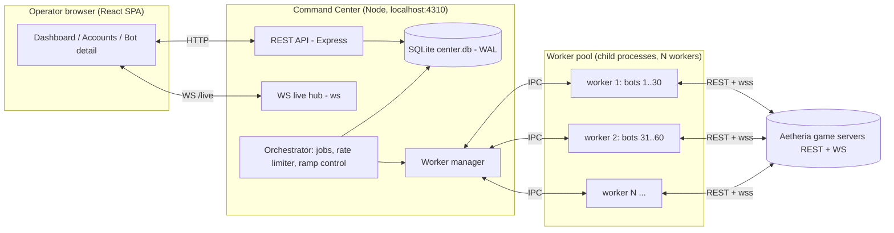
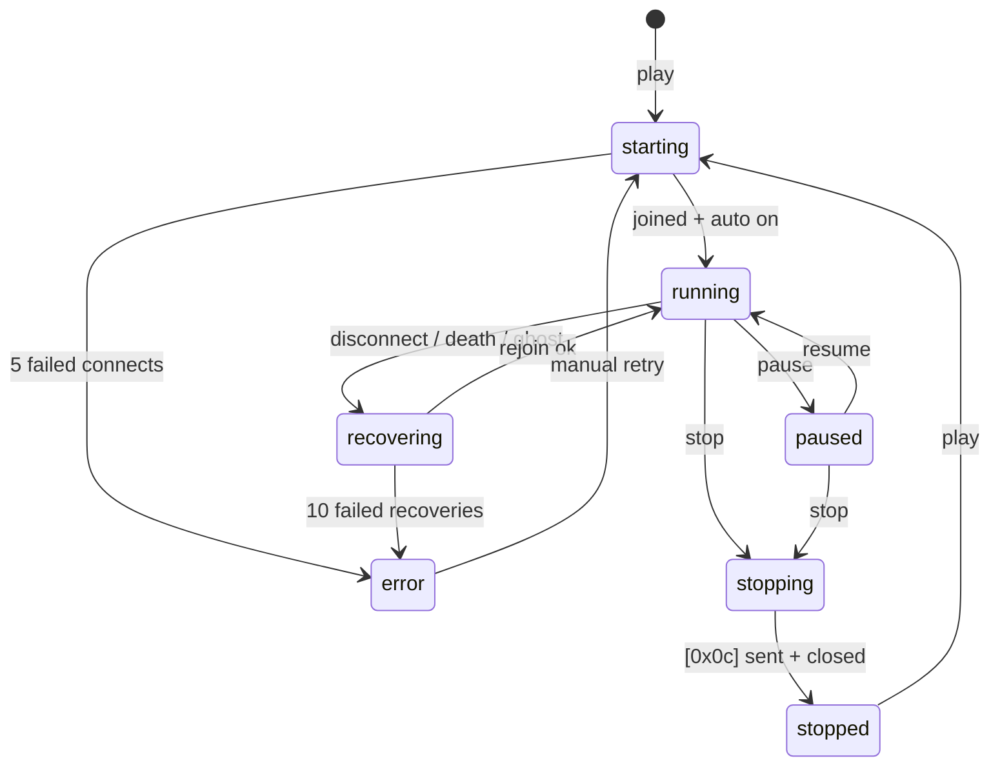

# Aetheria — Bot Command Center: Complete Implementation Spec

| | |
|---|---|
| **Status** | Draft v1.0 — ready for implementation agents |
| **Date** | 2026-10-04 |
| **Depends on** | `testbot/` (verified raw client + runner), protocol knowledge in `HEADLESS-TESTING.md`, `AUDIT-SEQUENCE.md` |
| **Target** | Local web app (localhost) to manage accounts, characters, and N concurrent bot sessions (10 → 100+) with a live dashboard |

---

## 1. Executive summary

Build a local **Command Center**: a Node.js backend (API + orchestration + SQLite) and a React web dashboard that together manage:

1. **Accounts & characters** — auto-register accounts in bulk (with rate-limit handling), auto-create one character per account (with collision-safe randomized names), import existing accounts, and let the operator checkbox-select which characters join the bot fleet.
2. **Bot sessions** — each bot runs in a **mode** (`leveling` = the current verified 26-step pipeline; `farm` = stub, "under development"), can be **played/paused/stopped individually**, and self-recovers from disconnects, deaths, ghost sessions, 429s, and server outages.
3. **Live command view** — a real-time dashboard: fleet KPIs, per-bot cards, live logs, step-by-step progress, charts, and bulk actions.

The command center **reuses the battle-tested headless engine** already in `testbot/src/` (raw ws client, auto-combat config, skill weaving, potion economy, travel, death recovery). It does not re-implement the game protocol.

**Scale objective:** 100 concurrent logged-in clients for server stress testing, on one Windows machine, with a performant local SQLite store and a UI that stays responsive at 100 bots.

---

## 2. Goals / Non-goals

### Goals
- G1 — One-click bulk account creation (guest flow), throttled for the game's rate limits, with live progress.
- G2 — One-click bulk character creation (exactly one per account), randomized giphy-style names, server-unique.
- G3 — Checkbox inclusion: choose exactly which accounts/characters join the bot fleet; newly created ones default-checked (configurable).
- G4 — Per-bot Play / Pause / Stop; per-bot mode selection (`leveling` / `farm (dev)`).
- G5 — Leveling mode = current verified pipeline (steps 01–26 + planned 27+, see Appendix A), per-bot cursor persistence, per-bot logs.
- G6 — Fleet scale to 100 concurrent bots, startable in staggered ramps; UI remains < 2 s latency; DB survives 500+ events/s.
- G7 — Self-healing: bot process crash → auto-restart; game disconnects/deaths/outages → automatic recovery (already proven in `runner.js`, ported into the engine).
- G8 — Everything local: single machine, single folder, single SQLite file, no cloud.

### Non-goals (this phase)
- N1 — Farm mode full automation (label "under development"; stub behavior only, see §10.6).
- N2 — Multi-user auth / remote access (single local operator; bind 127.0.0.1).
- N3 — Selling/arbitraging automation beyond the existing in-engine economy (potions/sell junk).
- N4 — Cloud deployment, containers, CI/CD.
- N5 — Anti-detection / stealth (this is for stress-testing our own service).

---

## 3. System primer — what already exists (read this first)

Source of truth for protocol = `testbot/src/client.js`; for pipeline = `testbot/src/runner.js`.

### 3.1 Verified protocol essentials (reuse, do not re-derive)
- **REST base**: `https://www.aetheria-online.in.th`
  - `POST /auth/guest` → `{ userId: "g_…", password, token }` (⚠ rate-limited → 429 when hit hard)
  - `POST /auth/login {userId, password}` → `{ token }` (for stored accounts; shape verified)
  - `GET /characters` (Bearer) → `{ characters:[{characterId, name, mapName, …}], slots, nameRules }`
  - `POST /characters {name}` → `{ characterId }` (nameRules: **3–16 chars**, `^[A-Za-z0-9ก-๙_]+$`, server-unique)
  - `POST /world/enter {characterId}` → `{ mapId, ticket, roomId, channel, endpoint }`
  - `POST <endpoint>/matchmake/joinById/<roomId> {ticket, batch:true}` → flat reservation `{name, sessionId, roomId, processId}`
- **WebSocket**: `wss://<endpoint-host>/<processId>/<roomId>?sessionId=…`
  - Frames: `0x0a` join (server→client, ack `[0x0a]`), `0x0b` error, `0x0c` **leave/ping group**, `0x0d` gameplay msg (`+ msgpack(type) + msgpack(data)` both directions), `0x0e/0x0f` state frames.
  - Batched events arrive as message `b`: `[[evt,data],…]` (hit, exp_gain, skill_fx, …).
- **Travel**: step into portal → server push `travel {mapId, ticket, roomId, channel, endpoint, displayName}` → send `[0x0c]`, close, `joinById` with new `{ticket}` → `arrived` on the new socket.
- **Combat commands**: `auto_set {config}` + `auto_set {enabled:true}` (refused in cities; `skills` = array of skill-id **strings**); manual skills = `cast {skillId, targetId}` (verified landing, e.g. bash).
- **Death**: server msgs `death {savePointName, autoReleaseSeconds:300}` → `respawn{to:'save'}` → `respawned`; **after death you MUST do a fresh `world/enter` + rejoin** (same-session `auto_set` stays refused — verified).
- **Ghost sessions**: killing a client process leaves the character "ออนไลน์อยู่แล้ว" (already online) for ~40–60 s. Reconnects must retry; graceful rejoin = send `[0x0c]` before close.

### 3.2 Engine behaviors already proven in `runner.js` (port verbatim)
| Feature | Where | Notes |
|---|---|---|
| Auto-sell junk / auto-bank cards+runes | `sellJunk()`, `bankProtected()` | n2 Bor vendor (`ซื้อของหน่อย`), n6 Alice storage |
| Potion economy | `buyPotions()`, `potCount()` | n2 General Goods, **Red Potion 90301 @50z**, auto `hpItems` from inventory `autoPotion:'HP'` flags, restock to 45 when <8 |
| Skill weaving | `weaveTick()` | server's auto-skill engine never fires skills for us → we `cast {skillId,targetId}` at mob-hit targets near our live position (selfPos from hits on us), ~1.35 s cadence, SP≥30 gate |
| Death recovery | `deathRecover()` | respawn → wait `respawned` → **reconnect** → sell junk (route to capital first) → buy potions → resume |
| Turn-key retries | executor in `runner.js` | infinite step retry w/ backoff; crash → `process.exit(3)` → supervisor restarts |
| Rate-limit backoff | `connectWithRetry`, `reconnect` | 60 s wait on "already online"/429, else 8 s |
| Per-bot state | `testbot/out/run-state.json` | `{cursor, characterId, charName}` — becomes per-bot in command center |
| Snapshot shape | `status.js` | basis of bot heartbeat payload (§11) |

### 3.3 Verified hazards (must be handled)
1. `/auth/guest` **429s** under bursts → registrations must be serialized + backed off (§9.4).
2. Hard process kill → ghost session lock ~40–60 s; **Stop** must use graceful leave.
3. Character names are **server-unique** → creation retries with fresh names (§9.3).
4. Thai text everywhere: **always UTF-8**; Node writes (`fs.appendFileSync`) fine; never round-trip through PowerShell console; UI must render Thai (font stack incl. "Noto Sans Thai", "Leelawadee UI", Tahoma).
5. Auto mode is refused in cities — engine only enables on field maps.
6. Colyseus room churn: many bots on one channel may congest; spread via `channel_switch {channel}` (§14.3).
7. `HEADLESS-TESTING.md` notes guest sessions rotate (rejoin handling exists; prefer **upgraded accounts** for the longest runs — see §9.5 open item).

---

## 4. Users & core UX requirements

**Primary user:** operator (you) running stress tests and leveling fleets. Single user, local machine, often watching while doing other work.

**Dealbreaker requirements (from operator):**

| # | Requirement | UI surface |
|---|---|---|
| U1 | "Create N accounts" — type a number, click; watch progress; checkbox "auto-include new accounts in bot roster" | Accounts page → Create Accounts wizard |
| U2 | "Create characters for accounts missing one" — one per account | Accounts page → toolbar button |
| U3 | Per-character **Include in bot** checkbox; bulk (select all / invert / by state) | Characters table |
| U4 | Randomized but human-sensible names (giphy-style word combos), collision-safe | Name gen config + preview; auto on create |
| U5 | Import existing accounts (userId+password, or session.json seeds) | Import dialog (paste list / pick file) |
| U6 | Per-bot **mode** dropdown: `leveling` (current chain) · `farm` ("under development" badge) | Bot card + Bot detail |
| U7 | Per-bot **Play / Pause** buttons (also bulk: play all, pause all, stop all) | Bot grid + detail |
| U8 | See everything: levels, exp/min, kills, deaths, map, HP/SP, potions, zeny, current step, live log | Dashboard + Bot detail |
| U9 | 100 bots must not melt the UI | Virtualized grid, throttled live updates, sparklines |

---

## 5. Architecture



**Design decisions (locked):**
- **Worker pool, not process-per-bot.** One child process hosts up to `MAX_BOTS_PER_WORKER` (default 30) async bots. Rationale: 100 bots × Node process ≈ 5–6 GB RAM; in-process async bots ≈ 1.5–2 GB and less CPU overhead. Crash isolation: if a worker dies, the manager restarts it and re-attaches its bots (cursor persisted; bots rejoin with ghost-retry).
- Bots are **async tasks** with their own `AetheriaClient` instance; the engine loop is cooperative-async (already the pattern in `runner.js`).
- Commander is the **only** process touching `center.db` (workers stream events to it over IPC; workers write only their per-bot JSONL logs).
- Registration/login queue lives in commander (global rate limiter). Workers never call `/auth/guest` — they use tokens staged in the bot spec; on token expiry they call `/auth/login` via the shared limiter API through IPC (`t:'auth_request'`).
- Everything is ESM Node 20, matching existing code.

---

## 6. Tech stack

| Layer | Choice | Why |
|---|---|---|
| Runtime | Node 20 (existing) | reuse `client.js`, msgpack, ws |
| Server HTTP | Express 4 | simple, ubiquitous for agents |
| Server WS | `ws` (existing dep) | matches testbot |
| DB | **better-sqlite3** (sync API) + WAL | fastest local option; no server; prepared statements; transactions |
| DB access | thin DAO module + write-buffer (batch in transactions every 250–1000 ms) | 100 bots × ~2 writes/s handled easily |
| Validation | Zod | request & IPC payload validation |
| Logging | pino (server) + per-bot JSONL files | JSONL keeps existing tooling (`status.js`, `raw-tail.mjs`) working |
| Frontend | React 18 + Vite + **TypeScript** + Tailwind | fast dev, typed |
| State | Zustand | tiny, WS-friendly |
| Charts | Recharts (sparklines + detail charts) | good enough at 100 bots if memoized |
| Tables | TanStack Table (or hand-rolled) | sorting/filter/bulk-select on 100+ rows |
| Virtualization | react-window (bot grid + log panes) | keeps 100 bots + log streams 60 fps |
| Build | Vite build → served statically by Express | single port in production mode |
| Tests | node:test for server units + Playwright-less smoke script (`smoke.mjs`) | keep light |

---

## 7. Repo layout

```
aetheria/
  command-center/
    package.json                # workspaces: server, web  (or two packages)
    server/
      src/
        index.ts|js             # express + ws bootstrap, single-instance lock
        config.ts               # ports, paths, limits (env-overridable)
        db/
          schema.sql            # DDL (see §8)
          dao.ts                # prepared statements, write buffer
        services/
          accounts.ts           # register/login/import/upgrade; token store
          characters.ts         # create/list/refresh; name assignment
          namegen.ts            # giphy-style generator (§9.3)
          rateLimiter.ts        # token bucket + backoff (§9.4)
          jobs.ts               # batch jobs (registration, character creation) + progress
          metrics.ts            # rolling rollups (kills/min, exp/min per bot & fleet)
        orchestra/
          workerManager.ts      # spawn/restart workers, dispatch IPC
          ramp.ts               # staggered start planner (§14.3)
          ipc.ts                # message schemas + validation (§11)
        api/
          routes.accounts.ts
          routes.characters.ts
          routes.bots.ts
          routes.system.ts
          liveHub.ts            # WS /live fanout, throttling
      engine/                   # ← extracted from testbot, importable
        protocol/client.js      # REUSE testbot/src/client.js (import, do not fork)
        botEngine.js            # Bot class refactor (modes, pause token, event sink)
        plans/leveling.js       # PLAN steps 01..26+ as data-driven list
        economy.js              # sellJunk/bankProtected/buyPotions/potCount
        weave.js                # weaveTick + target tracking
        recovery.js             # deathRecover/connectWithRetry/wrong-map logic
        paths.js                # per-bot data dirs
      worker/
        workerMain.js           # IPC host: attach/detach/pause/resume bots
    web/
      src/
        main.tsx, App.tsx
        pages/Dashboard.tsx · Accounts.tsx · BotDetail.tsx · Settings.tsx · Stress.tsx
        components/ (BotCard, BotGrid, KpiHeader, LiveLog, StepPipeline, Charts/*, NameTable, JobsPanel…)
        lib/live.ts             # WS client + store bindings
        lib/api.ts              # typed REST client
      index.html
    data/                       # gitignored
      center.db
      bots/<botId>/state.json   # cursor/characterId/mode
      bots/<botId>/run.jsonl    # per-bot event log (same format as today's run logs)
      supervisor.log            # legacy compatibility
```

**Reuse rule:** `command-center/server/engine/protocol/client.js` = direct import of `testbot/src/client.js` (single source of truth). If a circular-dep issue arises, copy once and freeze with a header note "synced from testbot/src/client.js <date>".

---

## 8. Data model (SQLite)

```sql
PRAGMA journal_mode=WAL;
PRAGMA synchronous=NORMAL;
PRAGMA busy_timeout=5000;
PRAGMA foreign_keys=ON;

CREATE TABLE accounts (
  id INTEGER PRIMARY KEY,
  label TEXT,                    -- operator alias, e.g. "bot-007"
  user_id TEXT NOT NULL UNIQUE,  -- g_… (guest) or upgraded id
  password TEXT NOT NULL,        -- stored locally (see §16)
  account_type TEXT NOT NULL DEFAULT 'guest',   -- guest | upgraded
  token TEXT,
  token_updated_at INTEGER,
  status TEXT NOT NULL DEFAULT 'new',           -- new|active|error|disabled
  include_default INTEGER NOT NULL DEFAULT 1,   -- include new chars in roster by default
  last_error TEXT,
  created_at INTEGER NOT NULL,
  updated_at INTEGER NOT NULL
);

CREATE TABLE characters (
  id INTEGER PRIMARY KEY,
  account_id INTEGER NOT NULL REFERENCES accounts(id) ON DELETE CASCADE,
  character_id INTEGER NOT NULL UNIQUE,   -- server id
  name TEXT NOT NULL,
  class_id TEXT,                          -- novice|swordsman|knight|…
  base_level INTEGER, job_level INTEGER,
  map_name TEXT,
  zeny INTEGER,
  included INTEGER NOT NULL DEFAULT 1,    -- checkbox "include in bot roster"
  state TEXT NOT NULL DEFAULT 'idle',     -- idle|queued|in_session
  last_sync_at INTEGER,
  UNIQUE(account_id, name)
);

CREATE TABLE bots (
  id INTEGER PRIMARY KEY,
  character_id INTEGER NOT NULL UNIQUE REFERENCES characters(id),
  mode TEXT NOT NULL DEFAULT 'leveling',  -- leveling | farm
  state TEXT NOT NULL DEFAULT 'stopped',  -- see §10.3 state machine
  worker_id TEXT,                         -- owning pool worker
  cursor_step INTEGER NOT NULL DEFAULT 0, -- index into plan (0-based)
  step_id TEXT,                           -- e.g. "23-farm-j50-stats"
  auto_resume INTEGER NOT NULL DEFAULT 0,
  log_filter TEXT,                        -- JSON per-category log override (§10.7); NULL = follow global
  started_at INTEGER, paused_at INTEGER, stopped_at INTEGER,
  last_heartbeat_at INTEGER,
  last_error TEXT,
  retry_count INTEGER NOT NULL DEFAULT 0,
  created_at INTEGER NOT NULL, updated_at INTEGER NOT NULL
);

-- sampled every ~20 s while running (charts)
CREATE TABLE bot_samples (
  bot_id INTEGER NOT NULL REFERENCES bots(id) ON DELETE CASCADE,
  ts INTEGER NOT NULL,
  base_level INTEGER, job_level INTEGER,
  base_exp INTEGER, job_exp INTEGER,
  hp INTEGER, max_hp INTEGER, sp INTEGER, max_sp INTEGER,
  kills INTEGER, deaths INTEGER,
  zeny INTEGER, pot_count INTEGER, weaves INTEGER,
  map_name TEXT,
  PRIMARY KEY (bot_id, ts)
) WITHOUT ROWID;
CREATE INDEX idx_samples_ts ON bot_samples(ts);

-- notable events (deaths, levelups, step done/fail, errors, buys) — full stream stays in run.jsonl
CREATE TABLE bot_events (
  id INTEGER PRIMARY KEY AUTOINCREMENT,
  bot_id INTEGER NOT NULL REFERENCES bots(id) ON DELETE CASCADE,
  ts INTEGER NOT NULL,
  type TEXT NOT NULL,   -- death|levelup|step_done|step_fail|auto_failed|buy|sell|recover|error|…
  data TEXT             -- JSON blob (truncate >4 KB)
);
CREATE INDEX idx_events_bot_ts ON bot_events(bot_id, ts DESC);
CREATE INDEX idx_events_ts ON bot_events(ts);

CREATE TABLE jobs (
  id INTEGER PRIMARY KEY,
  kind TEXT NOT NULL,           -- register_accounts | create_characters | import_accounts | upgrade_accounts
  payload TEXT NOT NULL,        -- JSON
  total INTEGER NOT NULL, done INTEGER NOT NULL DEFAULT 0,
  failed INTEGER NOT NULL DEFAULT 0,
  status TEXT NOT NULL DEFAULT 'queued', -- queued|running|done|failed|cancelled
  log TEXT,                     -- JSON array of {ts,msg,level} capped
  started_at INTEGER, finished_at INTEGER, created_at INTEGER NOT NULL
);

CREATE TABLE settings (key TEXT PRIMARY KEY, value TEXT NOT NULL);

CREATE TABLE fleet_stats (      -- rollups, one row per minute
  ts INTEGER PRIMARY KEY,       -- minute bucket
  bots_running INTEGER, bots_paused INTEGER, bots_error INTEGER,
  kills INTEGER, deaths INTEGER, base_exp INTEGER, job_exp INTEGER,
  zeny_delta INTEGER, pot_bought INTEGER
);
```

**Retention policy:** `bot_samples` keep 7 days; `bot_events` keep 14 days; `fleet_stats` keep 90 days; JSONL per bot rotates at 50 MB (`.1` suffix). Prune job runs nightly + on boot.

**Write-buffer pattern:** DAO accumulates inserts; flushes in a single transaction every 500 ms or 200 rows. All UI reads go through prepared read statements. DB expected size at 100 bots: ~40 MB/week (fine).

---

## 9. Accounts & characters service

### 9.1 Registration job (U1)
```
POST /api/jobs/register {count: 5, charsPerAccount: 1, autoInclude: true, startDelayMs: 4000}
→ 201 {jobId}
```
Job worker loop (single writer, serialized):
1. `POST /auth/guest` (retry/backoff per §9.4). Store `{user_id, password, token}` in `accounts`.
2. If `charsPerAccount > 0`: create character via §9.2 flow.
3. `include_default = autoInclude`; emit job progress (`WS: job_progress`), and `account_created` / `character_created` events.
4. On job cancel: stop after current item; keep completed ones.

**Live progress UI:** progress bar `done/total`, per-item line ("created bot-003 · char SwiftFalcon42"), failures with reason + retry button per item.

### 9.2 Character creation (U2)
For each account missing a character:
1. `name = NameGen.characterName()`; check local uniqueness (DB); then `POST /characters {name}`.
2. Server may reject duplicate → regenerate (max 5 attempts, then mark account `error`, record `last_error`).
3. Store character; sync `{class_id:'novice', base_level:1, job_level:1, map_name}` from subsequent `GET /characters` refresh (or from first join heartbeat).

Bulk trigger: `POST /api/jobs/create-characters {accountIds?}` (defaults to all accounts with 0 chars).

### 9.3 Name generator (U4)
"Giphy-style": 2-word adjective+noun combos, fantasy/wholesome flavor, occasional digits.

- `name = Adj + Noun + (30% → 2 digits)`; e.g. `SwiftFalcon`, `JollyWillow42`, `CosmicOtter`.
- **Hard constraints:** 3–16 chars, `^[A-Za-z0-9_]+$` (stay ASCII for safety), not in DB, retry on server conflict.
- Cap: adjective ≤ 8 chars, noun ≤ 7 chars to keep ≤16 with digits.
- Wordlists starter (extend freely; keep curated & clean):

```js
export const ADJ = ['Swift','Jolly','Cosmic','Brave','Silent','Lucky','Amber','Frost','Sunny','Mellow','Nimble','Royal','Happy','Bold','Gentle','Wild','Bright','Calm','Epic','Merry','Proud','Quiet','Rapid','Shiny','Wise','Zesty','Kind','Noble','Sleek','Vivid'];
export const NOUN = ['Falcon','Willow','Otter','Fox','Raven','Panda','Comet','Maple','Lynx','Heron','Bison','Cedar','Finch','Koala','Moth','Newt','Puma','Quail','Robin','Swan','Tiger','Viper','Wren','Yak','Badger','Crane','Dove','Gull','Hawk','Ibis'];
```
- Uniqueness strategy: `combos = ADJ×NOUN×{none,00..99}` ≈ 90k; DB lookup + `UNIQUE` + server retry → effectively collision-free at our scale.
- Also used for **account labels** (`bot-001`… or `SwiftFalcon` ref) — label stays editable.

### 9.4 Rate limiting & backoff (auth endpoints)
Centralized in commander; **defaults (configurable in Settings):**

| Parameter | Default | Notes |
|---|---|---|
| Min delay between `/auth/guest` calls | 4000 ms | token bucket, burst 2 |
| Backoff on 429 | 5 s → 10 → 20 → 40 → 60 (cap) | same request retried |
| Max attempts per account | 8 | then mark `error` |
| Concurrency | 1 (serialized) | registration is never parallel |
| `/auth/login` per worker | own bucket 1 req/3 s, jitter | rare (token expiry) |

All game REST traffic should include jitter (0–750 ms) to avoid lockstep bursts at 100 bots.

### 9.5 Import (U5)
- `POST /api/jobs/import-accounts {lines: "userId:password\n…", autoInclude}` — validate via `/auth/login` (rate-limited), store.
- Seed helper: "Import from testbot" button reads `testbot/out/session.json` (existing primary account) and imports it as the first row (do not print secrets to UI logs).
- **Open item:** guest sessions rotate; for marathon runs prefer upgrading accounts (`/auth/upgrade`, exact payload to be captured once via `testbot/src/auth-shape.mjs` — leave a TODO hook `accounts.upgrade()` in service + a disabled UI button).

---

## 10. Bot engine & worker pool

### 10.1 Engine extraction (from `runner.js` → `engine/`)
Refactor targets (keep behavior identical; tests = the current live flow):
- `botEngine.js` — class `BotEngine`:
  - ctor: `{ account, characterId, mode, cursorStep, dataDir, events (sink), ipc }`
  - owns `AetheriaClient`, message handlers (same as `runner.js` `bind()`), heartbeat emitter, `combat` estimates, `lastTargets`, `selfPos`, `weaves`, counters.
  - `start()` → connect (ghost-retry loop), join, sync, start heartbeat, then run **mode loop**.
  - `pause()` / `resume()` / `stop()` — via async control token (see §10.4).
  - `step(...)` executor: port of the infinite-retry step loop (cursor persist after `STEP_DONE`).
- `plans/leveling.js` — the 26 steps as an ordered array of `{id, run(bot)}` (port from `runner.js` PLAN; steps 13–16 are discovery probes → keep but tag `{dev:true}` and skip in production mode by default via setting).
- `economy.js`, `weave.js`, `recovery.js` — direct ports of the methods (no behavior redesign).
- Events: engine emits structured events → worker → commander → DB + WS. Per-bot JSONL still written locally by the worker (same JSON shape as today's `run-*.jsonl`, so `status.js`/`raw-tail.mjs` keep working when pointed at the file).

### 10.2 Bot spec handed to a worker (IPC attach)
```jsonc
{
  "t": "attach",
  "botId": 7,
  "account": { "userId": "g_…", "password": "…", "token": "…" },
  "characterId": 10011810,
  "mode": "leveling",
  "cursorStep": 22,           // resume index
  "settings": { "weaveSkills": ["bash"], "hpPercent": 75, "potionTarget": 45, "skipDevSteps": true }
}
```

### 10.3 Bot lifecycle / state machine

DB `bots.state` mirrors this; UI colors: starting=amber, running=green, paused=blue, recovering=orange, error=red, stopped=gray.

### 10.4 Play / Pause / Stop semantics (U7)
- **Play**: attach bot to a pool worker (or resume if attached); engine connects (ghost-retry), applies mode, sets `state=running`.
- **Pause** (graceful, target < 2 s): engine finishes current atomic action, sends `auto_set {enabled:false}` when on a field, parks loop; socket **stays connected** (stress-test keeps the client count); `state=paused`. If paused in a city (no auto), just park.
- **Resume**: re-apply auto config for current step; continue from cursor (in-memory if alive, else reload from `state.json`).
- **Stop** (graceful, releases session): disable auto → send `[0x0c]` leave frame → close; `state=stopped`. Critical to avoid 40–60 s ghost lock.
- **Bulk actions**: Play all / Pause all / Stop all / Restart all (with confirm + ramp option).
- **Safety valve (setting, default ON):** auto-pause a bot after 3 deaths within 10 min → `state=paused` + toast "auto-paused after repeated deaths"; operator resumes when ready. (Prevents 100 bots death-looping during a bad patch.)

### 10.5 Recovery matrix (port + extend)
| Condition | Detection | Action | Emits |
|---|---|---|---|
| Socket close | `close` event | reconnect loop (8 s / 60 s backoff) | `recover` |
| "already online" | error text match | wait 60 s, retry up to 10× | `recover` |
| Death | `death` msg | respawn → `respawned` → **reconnect** → sell → buy potions → return to map → resume auto | `death`, `recover` |
| Wrong map | map drift vs plan | route back (`ensureMap`) | `warn` |
| Server outage | fetch errors | retry forever w/ backoff; resume when up | `warn` |
| 429 on login (in worker) | status 429 | IPC `auth_request` to commander limiter | `warn` |
| Worker crash | manager detects exit | respawn worker; re-attach its bots from DB (state=recovering) | `worker_restart` |
| Step fail | executor catch | retry w/ backoff `min(120s, 8+7·n)`; after 10 fails → `state=error` | `step_fail` |
| Token expiry | 401 | `/auth/login` refresh via limiter | `recover` |

### 10.6 Modes
- **`leveling`** — full pipeline (Appendix A), cursor persisted after each step; UI shows `step 23/26 · goblin j50`.
- **`farm`** — **"Under development"**. UI: option visible with amber "dev" badge + tooltip "Farm mode is under development — joins the selected map and idles; combat automation coming soon." Behavior: connect, set auto with default combat config if on a field, idle loop; no economy/plan. This keeps the wiring (mode switch, worker support, UI) complete for the future.

### 10.7 Event categories & log include/exclude toggles
Every engine log line carries a **category tag** (`cat`) so the operator can include/exclude whole classes of events per sink.

**Categories** (map event names → cat; fixed in `engine/logCategories.js`):

| cat | events (examples) |
|---|---|
| `system` | run_start, joined, reconnect*, setAuto, HEARTBEAT summaries |
| `step` | STEP_START / STEP_DONE / STEP_FAIL |
| `travel` | travel_msg, traveled, map_resync, route |
| `skill` | **skill_use (every cast)**, skill_fx_self (every landing), own_cast |
| `combat` | mob-hit stream summaries, weave_idle, hits-taken, dmg stats |
| `levelup` | levelup |
| `death` | DEATH, death_recover, respawned |
| `economy` | buy_potions, pot_restocked, auto_sold, banked, item_used, refine*, shop*, market* |
| `npc` | npc_dialog, dialog choices, peco rental, egg claim |
| `warning` | auto_enable_failed, pot_no_budget, wrong_map_return, budget_short |
| `error` | STEP_FAIL, UNCAUGHT, reconnect fails, auth failures |
| `chat` | chat messages |

**Three sinks** (each category toggled independently per sink):
1. `file` — per-bot JSONL (`data/bots/<id>/run.jsonl`) — the raw forensic log.
2. `db` — `bot_events` feed (what charts/alerts read).
3. `live` — WebSocket stream to the UI log panes.

**Filter shape** (stored in `settings` key `log.defaults`; per-bot override in `bots.log_filter`, NULL = follow global):
```jsonc
{
  "skill":  { "file": false, "db": true,  "live": true  },
  "combat": { "file": false, "db": false, "live": false },
  "error":  { "file": true,  "db": true,  "live": true  },
  // …one entry per category; missing entry = all true
}
```

**Presets** (UI dropdown; “custom” appears once edited):
- `verbose` — everything on (debugging a single bot).
- `standard` (default) — file: all except `skill`/`combat`; db+live: everything except `combat`.
- `quiet` — file: `system,step,death,error` only; db+live: `step,levelup,death,error`.

**Rules & notes**
- `error` + `death` are **pinned on for the `db` sink** (safety: alerts must never miss); they can still be toggled for `file`/`live`.
- Volume math @100 bots: `skill` ≈ 1.5 casts/s/bot + fx confirmations ⇒ **~2–3 lines/s/bot (~500 MB/day fleet)** if file-enabled; that's why `standard` disables `skill`/`combat` on the file sink.
- Engine writes file-sink lines with the filter applied **in the worker**; commander filters db/live sinks server-side (workers still forward everything over IPC; filtering centrally keeps toggles instant).
- Filter changes apply immediately: commander → IPC `set_log_filter {botId, filter}` → worker updates its file sink; db/live re-filtered on the fly.
- The testbot scripts (`status.js`, `raw-tail.mjs`) keep working on any bot's JSONL and should display counts per category.

---

## 11. IPC protocol (commander ↔ worker)

Use `child_process.fork` (Node IPC). All messages JSON, validated with Zod. `workerId` implicit by channel.

**Commander → worker**
```jsonc
{ "t":"attach",  "botId":7, "account":{…}, "characterId":…, "mode":"leveling", "cursorStep":22, "settings":{…} }
{ "t":"detach",  "botId":7 }                       // stop (graceful leave)
{ "t":"pause",   "botId":7 }
{ "t":"resume",  "botId":7 }
{ "t":"query",   "botId":7 }                       // ask for immediate heartbeat
{ "t":"auth_request", "reqId":"a1", "kind":"login", "userId":"…", "password":"…" }
{ "t":"shutdown" }                                  // graceful worker stop
```

**Worker → commander**
```jsonc
{ "t":"ready", "workerId":"w2", "pid":1234, "capacity":30, "bots":[] }
{ "t":"bot_state", "botId":7, "state":"running", "stepId":"23-farm-j50-stats", "cursorStep":22, "map":"goblin_trail", "ts":… }
{ "t":"bot_heartbeat", "botId":7, "sample":{ /* §12.4 sample shape */ } }        // every 20–30 s per bot
{ "t":"bot_event", "botId":7, "evt":"death", "data":{…}, "ts":… }                // notable events only
{ "t":"auth_response", "reqId":"a1", "ok":true, "token":"…" }
{ "t":"bot_error", "botId":7, "message":"…", "fatal":false }
```
**Throttling:** heartbeats ≤ 1/s/bot (they are 1/20 s in practice); `bot_event` capped 5/s/bot (excess coalesced into one "burst" event). Raw full-rate events go only to the JSONL file.

---

## 12. Server API spec

All JSON, UTF-8, base `/api`. Errors: `{error, code, detail?}` with proper status codes. All mutating ops return the affected entity.

### 12.1 Accounts
| Method | Path | Body | Returns |
|---|---|---|---|
| GET | `/accounts?include=characters` | — | `[Account & {characters: Character[]}]` |
| POST | `/jobs/register` | `{count, charsPerAccount, autoInclude, startDelayMs?}` | `{jobId}` |
| POST | `/jobs/import-accounts` | `{lines, autoInclude}` | `{jobId}` |
| POST | `/jobs/create-characters` | `{accountIds?}` | `{jobId}` |
| PATCH | `/accounts/:id` | `{label?, include_default?, status?}` | `Account` |
| DELETE | `/accounts/:id` | — | `{ok:true}` (blocked if bot attached) |
| GET | `/jobs/:id` | — | `Job` (progress) |
| POST | `/jobs/:id/cancel` | — | `Job` |

### 12.2 Characters
| Method | Path | Body | Returns |
|---|---|---|---|
| GET | `/characters?filter=…` | — | `Character[]` (joined w/ account label) |
| PATCH | `/characters/:id` | `{included}` | `Character` |
| POST | `/characters/:id/refresh` | — | `Character` (re-pull from server list) |

### 12.3 Bots
| Method | Path | Body | Returns |
|---|---|---|---|
| GET | `/bots?state=&mode=&q=` | — | `Bot[]` (live join with character+account) |
| POST | `/bots` | `{characterIds:[…], mode, rampMs?}` | `{botIds:[…]}` — creates rows + starts (ramped) |
| POST | `/bots/:id/play` | — | `Bot` |
| POST | `/bots/:id/pause` | — | `Bot` |
| POST | `/bots/:id/stop` | — | `Bot` |
| POST | `/bots/:id/mode` | `{mode}` | `Bot` (requires paused/stopped, else 409) |
| POST | `/bots/actions` | `{action: play\|pause\|stop, ids?:[…], all?:true}` | `{affected:n}` |
| PUT | `/bots/:id/log-filter` | `{filter: {…}\|null}` (null = follow global) | `Bot` |
| GET | `/bots/:id/events?limit=200&type=&cat=` | — | `Event[]` |
| GET | `/bots/:id/samples?from=&to=` | — | `Sample[]` (chart data) |
| GET | `/bots/:id/log?tail=500&cat=` | — | `{lines: string[]}` (tail of JSONL, parsed; optional category filter) |
| GET | `/settings/logging` | — | `{defaults: LogFilter, presets: {name: LogFilter}}` |
| PUT | `/settings/logging` | `{defaults: LogFilter, applyToBots?: true}` | `{ok:true}` |

### 12.4 Live WS (`/live`)
On connect: `{"type":"hello","snapshot":{bots:[…], stats:{…}, jobs:[…]}}`. Then incremental:
```jsonc
{ "type":"bot_update", "id":7, "patch":{ "state":"paused", "hp":231, "level":{...} } }   // 1–2 s cadence
{ "type":"bot_event",  "id":7, "evt":"levelup", "data":{...}, "ts":… }                   // notable only
{ "type":"job_progress","jobId":3, "done":2, "total":5, "line":"created bot-003 · char SwiftFalcon42" }
{ "type":"fleet_stats", "stats":{ "running":42, "paused":3, "killsPerMin":310, "baseExpPerMin":82000, ... } }  // every 5 s
{ "type":"worker_event","workerId":"w1", "evt":"restart", "detail":"exit 3" }
{ "type":"log_settings", "defaults":{…} }                                  // pushed when settings change
{ "type":"toast", "level":"warn|error|success", "msg":"…" }
```
Client may send `{"type":"focus","botId":7}` / `{"type":"unfocus"}` to subscribe to that bot's fine-grained events (detail page): cadence up to 4/s, capped.

---

## 13. UI specification

### 13.1 Global layout (dark theme, game-inspired but functional)
```
┌──────────────────────────────────────────────────────────────────────┐
│ ⌘ Aetheria Command Center     [fleet kpi chips]      ⚙ settings  ●live│
├──────┬───────────────────────────────────────────────────────────────┤
│ Nav  │  Page content                                                 │
│ Dash │                                                               │
│ Acct │                                                               │
│ Bots │                                                               │
│ Strss│                                                               │
└──────┴───────────────────────────────────────────────────────────────┘
```
KPI chips (always visible): `● 42 running` `⏸ 3 paused` `✖ 1 error` `⚔ 310 kills/min` `▲ 82k base/min` `�job 61k job/min` `☠ 2 deaths/10m` `🕒 next milestone: J50 in ~38m (fleet)`. Cheap CSS updates; numbers from `fleet_stats`.

### 13.2 Dashboard (Bots grid)
- Controls row: mode filter, state filter, search, select-all, bulk buttons (▶ Play | ⏸ Pause | ⏹ Stop | ⟳ Restart), ramp input ("start N bots over X min").
- Grid of `BotCard` (virtualized, 3–6 columns responsive). Card shows:
  - Name + class icon + `base/job` levels + XP progress bars (base/job)
  - State dot + mode badge (`leveling` | `farm dev`)
  - Map name; HP/SP mini-bars; potions count; zeny
  - Step progress for leveling: `▰▰▰▰▰▰▰▰▰▰▱▱▱▱▱ 23/26 goblin j50`
  - Sparkline: kills/min last 30 min (tiny SVG)
  - Footer: ▶/⏸ buttons, ⛶ open detail, checkbox for bulk ops
  - Last event line (single, muted, updated live; e.g. "12:41:02 ⚔ leveled job 39")
- Empty state: "No bots yet → go to Accounts and create/included characters, then Play."

### 13.3 Accounts page
- **Toolbar:** `Create accounts [N] [✓ chars] [✓ auto-include] [Create]` · `Create characters for all` · `Import…` · `Refresh all from server`.
- **Jobs panel** (live): progress bars + per-item log lines, cancel buttons, failure list with retry.
- **Accounts table:** label (editable), userId (copyable), type badge (guest/upgraded), status, token age, include-default checkbox, chars count, actions (create char, disable, delete).
- **Characters table:** account label, name (+ regenerate-name button pre-creation), class, base/job, map, **Include in bot ✓**, state (idle/queued/in_session), actions (Play now).
- **Name preview pane:** "Next names: SwiftFalcon, JollyWillow42, CosmicOtter …" (regen button), plus wordlist edit (Settings).

### 13.4 Bot detail page (focus mode)
Header: identity, state badge, mode select (disabled when running), **▶ ⏸ ⏹** buttons, "auto-paused after 3 deaths" banner when applicable.
Tabs:
1. **Live log** — streaming; **category filter chips** (skill, combat, economy, death, …; reflects the `live` sink toggles + per-view quick filters); text search; pause-scroll toggle; ring buffer 2 000 lines; export button (download JSONL segment).
2. **Pipeline** (leveling) — visual stepper 01→34: done ✅ / current ⏳ (with retries + last error) / pending ⚪ / skipped (dev steps); retry-step button (paused only).
3. **Stats** — charts: levels over time, exp/min (base+job), kills/min, **skill casts/min (skill_use) + fx-landed/min**, deaths markers, zeny, potions; range 1 h/6 h/24 h.
4. **Inventory & economy** — potion counts, bag used/weight, zeny; last sells/buys table.
5. **Raw config** — current `auto.config` readback (skills, hpItems, radius) + weave stats + **Log override** (tri-state grid: Follow global / Custom per category × sink).

### 13.5 Stress page (Phase 4)
- Ramp builder: target bots N, ramp duration, channel assignment policy (auto round-robin / fixed), map preference.
- Live: bots-online gauge vs elapsed, server probe latency (HEAD `/` every 30 s), local CPU/RAM meters, error-rate sparkline, kill-switch button **STOP ALL** (big red, double-confirm).

### 13.6 Settings page
Rate limits (min delay, backoff cap), pool sizing (`MAX_BOTS_PER_WORKER`, max workers), ramp defaults, auto-pause rule (deaths threshold/window), name wordlists, data retention days, "skip dev steps" toggle (steps 13–16), global potion/weave defaults.

**Logging section (new):** preset dropdown (verbose / standard / quiet / custom) + a switch grid:
```
                 File    Events(DB)   Live
system           [x]      [x]         [x]
step             [x]      [x]         [x]
travel           [x]      [ ]         [x]
skill            [ ]      [x]         [x]
combat           [ ]      [ ]         [ ]
levelup          [x]      [x]         [x]
death            [x]      [x] pin     [x]
economy          [x]      [x]         [x]
npc              [x]      [x]         [x]
warning          [x]      [x]         [x]
error            [x]      [x] pin     [x]
chat             [ ]      [ ]         [ ]
```
Plus “Apply to all bots” (clears per-bot overrides) and a live hint of estimated log volume (`~N lines/min/bot`).

### 13.7 Interaction rules
- All destructive/bulk ops require confirm (modal summarising count).
- Optimistic UI for play/pause: button shows spinner until next `bot_update` or 5 s timeout.
- Toasts: death, levelup (only our own + filter), step_done/fail, worker restart, 429 storms, auto-pause. Dedup + rate-limit toasts (max 5/s, coalesce).
- Keyboard: `/` focus search, `space` toggles selected bot when card focused (nice-to-have).

---

## 14. Non-functional requirements

### 14.1 Performance targets
| Metric | Target |
|---|---|
| UI: dashboard with 100 bots | ≥ 30 fps interactions; grid updates ≤ 2 s latency |
| API latency (p95, local) | < 50 ms |
| DB writes | 100 bots @ ~1 heartbeat/20 s + ≤ 3 events/s total ≤ 400 rows/s (batched transactions) |
| Memory: 100 bots in 4 workers | ≤ 2.5 GB working set (target); hard alarm 4 GB |
| Event loop: per worker 30 bots | heartbeat drift < 5 s |
| Start storm | ramp default 1 bot / 3–6 s, jitter ±50 % |

### 14.2 Local resource guardrails
- If process RSS > threshold → pause queue of starts, toast warning.
- If worker restart rate > 3 / 5 min → show fleet banner, suggest pausing half.

### 14.3 Channel/map distribution (stress testing)
- On start, commander assigns channels round-robin (`channel_switch`) across the channel range observed (1..N; configurable, default spread 1–15) to avoid single-channel congestion.
- Optional map spread for farm stress: distribute across `field_01`, `willow_road`, `goblin_trail`, `sun_farm` (configurable list).

### 14.4 Persistence & boot behavior
- Single-instance lock (port bind + pid file). On boot: prune data, mark all `bots.state='stopped'` unless `auto_resume=1`, show toast "N bots were running — resume?" with bulk Play.
- Per-bot `state.json` written after every step (crash-safe cursor).

---

## 15. Error handling & edge cases
| Case | Behavior |
|---|---|
| Duplicate character name on create | regenerate name (5×) → account error + UI retry |
| Guest 429 during register | backoff ladder; job shows "waiting out rate limit (retry 3)" |
| Bot start when character already in another session (ghost) | engine retry loop handles; UI state `starting` until join |
| Server outage mid-run | workers auto-retry; UI shows amber "recovering" + outage banner if > 5 bots affected |
| Worker crash | manager respawns (backoff 5 s), re-attach bots; toast + event |
| Commander crash | on boot, bots are `stopped` (sockets closed anyway); optional auto-resume |
| Pause while bot is mid-travel | pause request queued; travel completes; then park (state `paused`) |
| Stop while mid-travel | abort after travel hop completes; write cursor; graceful leave |
| Name gen exhausted | fall back to `Bot` + 5-digit counter, alert operator |
| Thai text encoding | all files UTF-8 no BOM; JSON only; UI font stack includes Thai fonts |

---

## 16. Security & safety (local tool)
- Bind **127.0.0.1** only; no remote access by default.
- Credentials stored in local SQLite (clearly documented); optional AES-GCM-at-rest key in `settings` is a stretch task (Phase 5, not required).
- Never render tokens/passwords into UI logs; mask in API responses (`token: "****"` + `token_updated_at`).
- **Kill switch** on Stress page: stops all bots gracefully (uses 0x0c to avoid ghosts).
- Operator confirmation for destructive actions; no auto-deletion of accounts with bots.
- Respect the game's rate limits by design (serialized registration; jitter). This tool targets our own stress-test environment.

---

## 17. Phased implementation plan (for agents)

> Each phase must leave the repo runnable. Phases 0–2 have no UI dependency order issues if stubs are used.

### Phase 0 — Scaffold & data layer (agent A)
- Create `command-center/` (server package first), config, logger, single-instance lock, SQLite init from `schema.sql`, DAO with write-buffer, retention prune.
- CLI: `npm run dev:server` starts API skeleton with `/api/system/health`.
- **Done when:** DB file created; health endpoint 200; unit tests for DAO batch insert (1k rows < 50 ms).

### Phase 1 — Accounts & characters services + jobs (agent B)
- `namegen.ts` (with wordlists + tests), `rateLimiter.ts`, `accounts.ts`, `characters.ts`, `jobs.ts`.
- Endpoints §12.1/§12.2 + WS `job_progress`.
- **Done when:** registering 3 accounts + chars from curl works end-to-end (throttled, retried); duplicate-name path covered by test with a mocked 409; import of `testbot/out/session.json` verified.

### Phase 2 — Engine extraction + worker pool (agent C)
- Port `runner.js` internals into `engine/` (`botEngine`, `plans/leveling`, `economy`, `weave`, `recovery`), no behavior change. Keep JSONL logging per bot (`data/bots/<id>/run.jsonl`).
- `worker/workerMain.js` + `orchestra/workerManager.ts` + IPC (§11).
- **Done when:** one real bot can be attached via IPC, runs leveling from cursor 22, survives a forced disconnect, and heartbeats reach the commander; manual kill of worker respawns and re-attaches.

### Phase 3 — Bots API + live hub (agent D)
- §12.3 endpoints, `/live` WS (throttling, focus, fleet_stats rollups), auto-pause safety rule.
- **Done when:** 5 bots start via API with ramp; pause/resume/stop individually and in bulk; live feed updates < 2 s; stop produces no ghost lock (verify by immediate re-play).

### Phase 4 — Web UI (agent E)
- Vite+React+TS+Tailwind scaffold; Dashboard, Accounts, Bot detail, Settings; typed API client; Zustand store wired to `/live`.
- **Done when:** all U1–U8 flows usable without curl; 100 fake bots (seed script producing synthetic `bot_update`s) render at 30 fps; real 10-bot run shown live.

### Phase 5 — Stress tooling & polish (agent F)
- Stress page (ramp builder, channel/map spread, resource meters, kill switch), worker/proc metrics, retention tuning, toasts, keyboard shortcuts, farm-mode stub + badge.
- **Done when:** 100-bot ramp scripted and observed; memory within target; docs updated (`README.md` in `command-center/` + addendum to `HEADLESS-TESTING.md`).

---

## 18. Acceptance criteria (definition of done — overall)
1. From a cold start: create 5 accounts (+chars) via UI in one action; all appear in tables with progress; duplicates auto-retried; no manual steps.
2. Include checkboxes control exactly which characters can be played; newly created default per setting.
3. Starting 10 bots: staggered, all reach `running`, dashboard reflects within 2 s; UI stays fluid.
4. Per-bot and bulk pause/resume work (< 2 s state change); pause keeps the ws session; resume continues the same step.
5. Stop → immediately Play again succeeds (no ghost lock; validates 0x0c leave).
6. Leveling mode from cursor resumes the current live pipeline (can adopt ScoutA1 at cursor 22 with the same behavior seen in `testbot` runs).
7. Kill worker process → bots recover automatically; UI shows recovery; no data loss of cursor.
8. 100 bots: commander + workers stay under memory target; DB grows < 10 MB during a 30-min ramp; no commander crash; UI usable.
9. All Thai strings render correctly in UI and logs (no mojibake anywhere).
10. `farm` mode selectable, shows "under development", and runs its stub without crashing.

---

## 19. Open questions / verify-before-build
1. **`/auth/upgrade` payload** (guest → registered with real credentials/email?) — capture once with `testbot/src/auth-shape.mjs`; needed for marathon (7-day) runs.
2. Token TTL + refresh cadence for guest/upgraded — instrument one account for 30 min and record 401s.
3. Channel count per map (affects round-robin); expose a "discover channels" probe (channel_switch error surface or chat presence).
4. Server per-IP connection caps for wss rooms (observed OK at ~10; verify at 50/100 during Phase 5 ramp).
5. Whether `farm` should reuse leveling's economy loop while "idle" (decision: no, stub only).
6. UI language: English default (operator preference unknown) — i18n scaffold with Thai strings optional.

---

## Appendix A — Leveling plan (current verified pipeline)

Source of truth: `testbot/src/runner.js` → `PLAN`. Steps (production skips `dev` ones by default):

| # | id | summary |
|---|---|---|
| 01 | stats-initial | STR 10 / DEX 10 (strict) |
| 02 | travel-east-meadow | route to `field_01` (ทุ่งหญ้าตะวันออก) |
| 03 | farm-job10 | auto-farm → Job 10 |
| 04 | basic-skill-9 | Basic Skill 9 |
| 05 | back-to-capital | route back |
| 06 | valkyrie-swordsman | Valkyrie dialog → Swordsman (gate: Job10 + Basic 9) |
| 07 | stats-dex10-rest-str | DEX 10 → dump STR |
| 08 | travel-willow-road | route to `willow_road` |
| 09 | farm-lv12 | auto-farm → base 12 |
| 10 | skills-bash-sword | Bash 10 + Sword Mastery 10 |
| 11 | auto-bash | set auto skills `['bash']` (weave provides actual casts) |
| 12 | travel-capital | route back |
| 13..16 | market/blacksmith/npc probes | **dev-only** discovery steps (skip in prod) |
| 17 | sell-junk | vendor junk for zeny |
| 18 | buy-saber | Ring Pommel Saber (91016) — budget loop |
| 19 | buy-ores | Phracon ×4 + Rough Elunium ×12 |
| 20 | refine-saber | refine to +4 (100 % rates; costs 275/386/538/725z) |
| 21 | equip-saber | equip weapon |
| 22 | travel-goblin | route to `goblin_trail` |
| 23 | farm-j50-stats | auto-farm to **Job 50**, stat plan DEX20/AGI20 → STR dump, weave bash, potion economy |
| 24 | skills-j50 | Provoke 3, HP Recovery 10, Endure 10, Magnum Break 6 |
| 25 | knight-change | Valkyrie dialog → **Knight** (อัศวิน) |
| 26 | stats-knight | DEX 30 / AGI 30 / VIT 20 → dump STR |

**Steps 27–31 (final operator sequence — replaces earlier DR-gear/Broad-Sword plans, both cancelled):**
| # | id | summary |
|---|---|---|
| 23b | gems-refine-equip | **REMOVED 2026-10-05** — no-op stub (kept so per-bot plan cursors stay aligned); formerly: refine in-bag gems to +4 + equip |
| 23c | orc-egg | Event Lily (n9 @2032,1626): free **Orc Baby Egg** at base ≥15 (once per character); _hatch via `inv_use` (eggs are usable items, not equipment!) then `pet_set {petId}` to activate_ |
| 27a | pet-hatch | safety/recovery step: hatch + activate pet from bag if not already |
| 27 | travel-gale | route to `gale_high` (ที่ราบสูงเกล) |
| 28 | farm-gale-job27 | auto-farm to job 27 (4 knight skills = 26 skill points) |
| 29 | skills-gale | Bowling Bash 10, Two-Hand Quicken 10, Peco Peco Ride 1, Peco Peco Master 5 |
| 30 | peco-rental | **Healer Mira (n1 @2288,1168 — the "top-right NPC" with the peco prop)** option `เช่า Peco Peco` (2,500z, needs ride skill) |
| 31 | frost-farm | route to `frost_pass`, farm until base 60 |

## Appendix B — Protocol cheat-sheet (send while in-room)
```
move_to {x,y} · move {dx,dy} · arrived {}
stat_up {stat,n} · skill_up {skillId}
auto_set {config|enabled} · cast {skillId,targetId}
npc_talk {npcKey} · npc_option {index} · npc_close {}
shop_sell_many {lines:[{slot,qty}]} · shop_buy {itemId,qty}
storage_put {slot,qty} · refine {source:{kind,slot},blessing}
market {op:'search'|'buy',…} · inv_sort {} · channel_switch {channel}
respawn {to:'save'} · (leave frame: raw 0x0c)
```
Key NPCs: n2 Bor (vendor + General Goods), n3 Enok (blacksmith/refine), n5 Valkyrie (class change), n6 Alice (storage/Heal/warp).

## Appendix C — Environment notes
- Windows + PowerShell 5.1 quirks: never edit files via console; write scripts/JSON with Node or UTF-8 (no BOM for JS/TS; BOM-safe for CSV only).
- Node 20 ESM. `better-sqlite3` needs prebuilt binaries for Node 20 (available) — if build issues, fall back to `node:sqlite` (Node 22+) or `sql.js`.
- Ports: API+static `4310`; dev web `5174`. Configurable via `command-center/server/.env`.
- Data dir gitignored; provide `npm run seed:demo` = synthetic 100-bot feed for UI development without the game.
